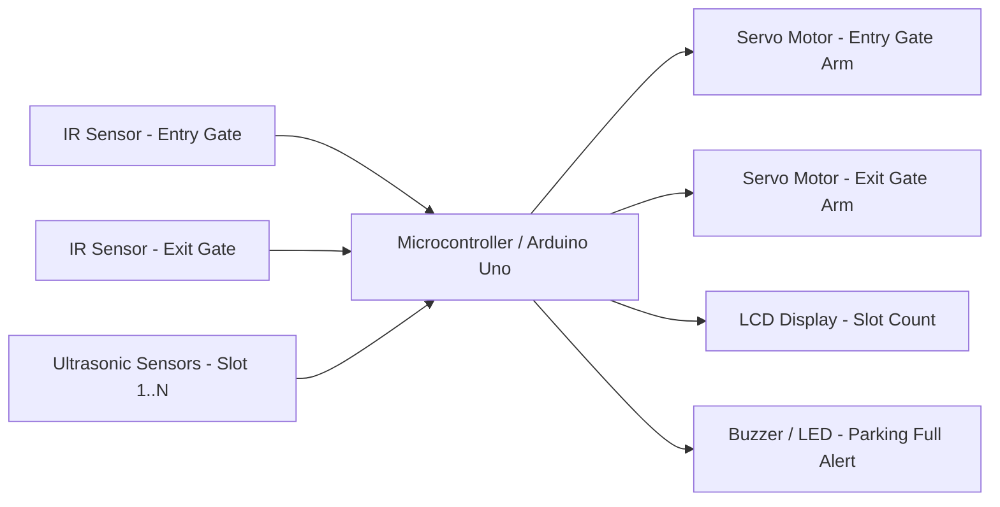
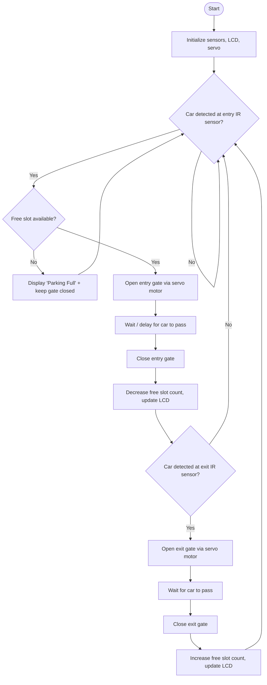

# -Automatic-Car-Parking-System
 Traditional parking management systems rely on manual monitoring, which is slow, labor-intensive, and prone to human error. This project presents an Automatic Car Parking System that addresses these limitations using low-cost embedded hardware. The system is built around an Arduino Uno microcontroller connected to IR sensors at the entry and exit gates and ultrasonic sensors placed at each parking slot. When a vehicle approaches the entry gate, the IR sensor detects its presence, and the controller checks slot availability using data from the ultrasonic sensors. If a free slot exists, the gate opens via a servo motor and the vehicle is allowed in; if the lot is full, the gate remains closed and the LCD display shows an appropriate alert. A similar mechanism operates at the exit, incrementing the free-slot count once a vehicle leaves. The system operates as a simple sense-decide-act loop, functioning like a finite state machine that transitions between idle, detection, decision, and gate-action states. This project demonstrates a practical, scalable application of sensor integration and embedded control, with potential extensions such as RFID-based billing, IoT connectivity, or number-plate recognition for fully automated smart parking.
 # 🚗 Automatic Car Parking System

An embedded-systems project that automates entry, slot detection, and exit
in a parking lot using sensors, a microcontroller, and actuators — removing
the need for a human gatekeeper and reducing search time for drivers.

---

## 📌 Table of Contents
1. [Introduction](#introduction)
2. [Objective](#objective)
3. [Theory / Working Principle](#theory--working-principle)
4. [Block Diagram](#block-diagram)
5. [System Flowchart](#system-flowchart)
6. [Components Used](#components-used)
7. [Circuit Connections](#circuit-connections)
8. [Software / Code Logic](#software--code-logic)
9. [Advantages](#advantages)
10. [Limitations](#limitations)
11. [Future Scope](#future-scope)
12. [How to Run This Project](#how-to-run-this-project)

---

## Introduction

Manual parking management is slow, error-prone, and needs constant staffing.
An **Automatic Car Parking System** solves this by using **IR sensors** to
detect vehicles at the entry/exit gate and **ultrasonic sensors** to check
whether each parking slot is occupied or free. A microcontroller (Arduino
Uno) reads this sensor data, decides whether to open the gate (via a servo
motor), and displays the number of available slots on an **LCD screen**.

## Objective

- Automatically open/close the entry and exit gate when a car arrives or leaves.
- Continuously monitor each parking slot and detect occupied/free status.
- Display real-time slot availability on an LCD.
- Prevent entry once the parking lot is full.

## Theory / Working Principle

The system works on a simple **sense → decide → act** loop:

1. **Sensing** – An IR sensor at the entry gate detects the interruption of
   its infrared beam when a car arrives (IR sensors work on the principle
   that an IR LED emits light and a photodiode/phototransistor detects the
   reflected or interrupted beam).
2. **Deciding** – The microcontroller checks the current **slot count**
   (updated using ultrasonic sensors placed above/beside each slot, which
   calculate distance using the time-of-flight of a sound pulse:
   `distance = (speed of sound × time) / 2`).
   - If a free slot exists → allow entry.
   - If all slots are occupied → keep the gate closed and show "PARKING FULL".
3. **Acting** – A **servo motor** rotates the gate arm open for a few
   seconds (using a timer/delay) and then closes it automatically.
4. The **LCD display** continuously shows the number of available slots so
   drivers don't need to search manually.
5. The same IR-sensor logic at the exit gate opens the gate when a car
   leaves and increments the free-slot count.

This is essentially a **finite state machine**: `IDLE → CAR_DETECTED →
CHECK_SLOTS → GATE_OPEN → GATE_CLOSE → IDLE`.

## Block Diagram



## System Flowchart


*(GitHub renders these Mermaid diagrams automatically when this file is viewed in the repo.)*

**Custom diagrams (image versions):**


## Components Used

| Component | Purpose |
|---|---|
| Arduino Uno (or similar microcontroller) | Central controller — reads sensors, controls actuators |
| IR Sensor Module (x2) | Detects car presence at entry and exit gates |
| Ultrasonic Sensor (HC-SR04) (x N slots) | Detects whether a parking slot is occupied |
| Servo Motor (SG90/MG995) (x2) | Physically opens/closes the gate arm |
| 16x2 LCD Display (with I2C module) | Shows number of free slots / "Parking Full" |
| Buzzer / LED (optional) | Alerts when parking is full |
| Breadboard, jumper wires, 5V power supply | Circuit assembly and power |

## Circuit Connections

- IR sensor **OUT** pin → Arduino digital input pin (entry & exit separately).
- Ultrasonic sensor **TRIG/ECHO** pins → Arduino digital pins (one pair per slot).
- Servo motor **signal** pin → Arduino PWM pin; power from external 5V supply (not directly from Arduino 5V, to avoid brownouts).
- LCD **SDA/SCL** (I2C) → Arduino A4/A5.
- Common **GND** for all modules and Arduino.

## Software / Code Logic

Pseudocode for the Arduino sketch:

```
setup():
    initialize LCD
    set IR pins as INPUT
    set servo pins as OUTPUT
    freeSlots = totalSlots

loop():
    for each slot sensor:
        if distance < threshold: slot occupied
        else: slot free
    update freeSlots count
    display freeSlots on LCD

    if entryIR triggered AND freeSlots > 0:
        openServo(entryGate)
        delay(carPassTime)
        closeServo(entryGate)
        freeSlots--

    if exitIR triggered:
        openServo(exitGate)
        delay(carPassTime)
        closeServo(exitGate)
        freeSlots++

    if freeSlots == 0:
        display "Parking Full"
        keep entry gate closed
```

## Advantages
- Reduces manpower requirement at parking lots.
- Saves driver's time by showing live slot availability.
- Reduces congestion at the entrance since full lots deny entry automatically.
- Simple, low-cost hardware (all components are inexpensive and easily available).

## Limitations
- Ultrasonic sensors can occasionally misread due to reflective surfaces.
- Single microcontroller may need additional multiplexing for large lots with many slots.
- No online/app-based booking in this basic version.

## Future Scope
- Add RFID/ANPR (number plate recognition) for ticketless, automated billing.
- Connect to an IoT dashboard/app to show live availability remotely.
- Add camera-based slot detection using image processing instead of ultrasonic sensors.

## How to Run This Project
1. Assemble the circuit as per the **Circuit Connections** section.
2. Upload the Arduino sketch (`car_parking_system.ino`) using the Arduino IDE.
3. Power the circuit and observe the LCD for slot count.
4. Bring an object near the entry IR sensor to simulate a car — the gate should open if slots are free.

---

### 📷 Photos & Circuit Diagrams
Add your own project photos here as you build it — see the "Adding photos" step in the GitHub guide for exact instructions:

```


```

---

## 📄 License
This project is open-source — feel free to use and modify it for learning purposes.
